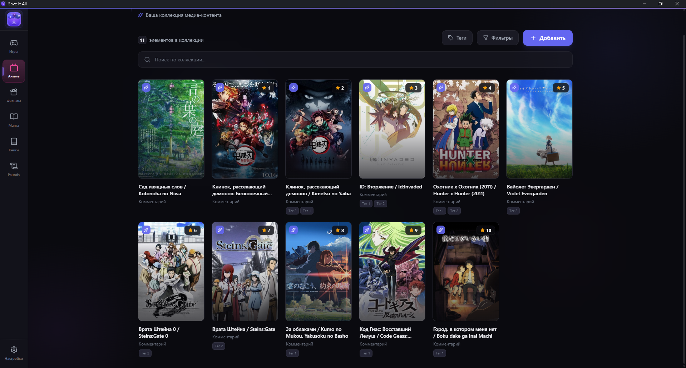
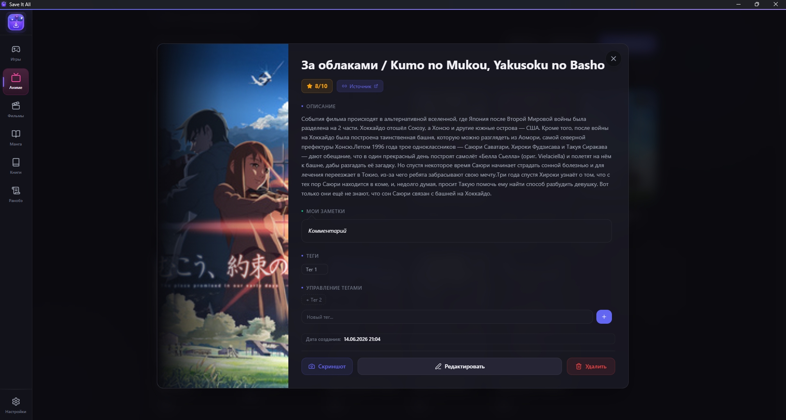
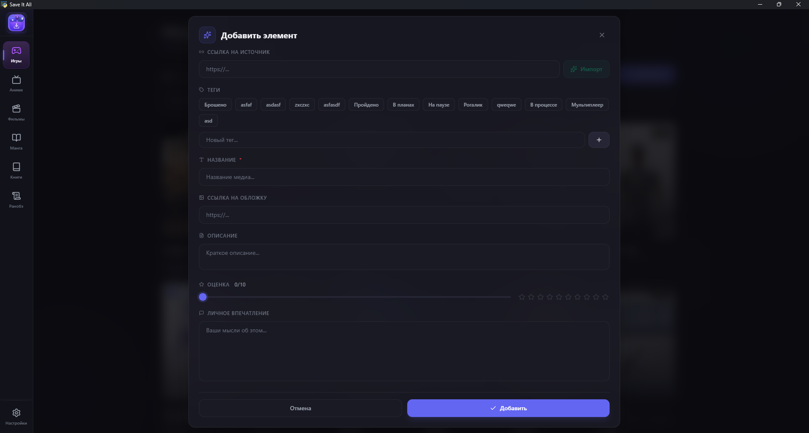
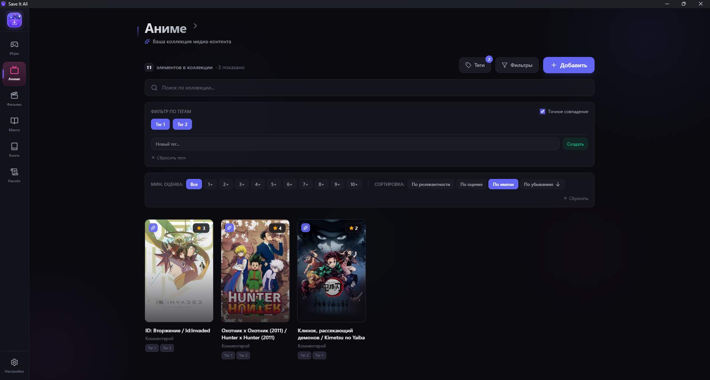
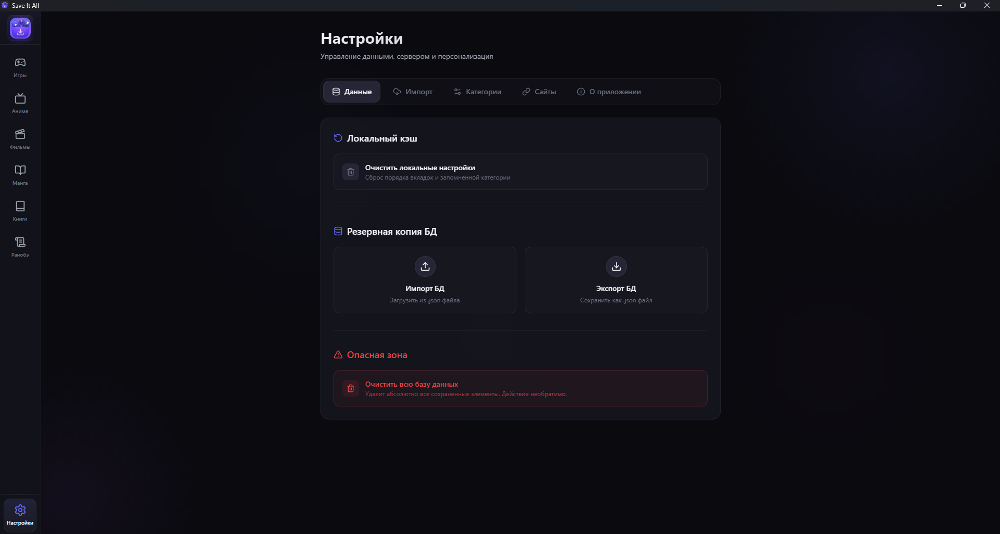

# Save It All

Локальный трекер медиа-контента. Храни и оценивай что угодно в одном месте - с обложками, оценками, тегами и заметками.

## Возможности

- **Шесть категорий** — игры, аниме, фильмы, манга, книги, ранобэ
- **Кастомизация** — переименуй категории и поменяй их иконки, перетаскивай порядок в сайдбаре
- **Быстрое добавление** — вставь ссылку с поддерживаемого сайта, данные подтянутся автоматически
- **Теги и фильтры** — сортируй и ищи по тегам, рейтингу, тексту внутри карточки
- **Скриншот карточек**
- **Экспорт/Импорт** - экспортируй данные из sqlite базы данных в json для простого переноса данных
- **Лёгкое добавление новых парсеров** - все парсеры удобно хранятся в `frontend\src\lib\parsers`

## Поддерживаемые сайты

| Сайт | Что парсится |
|------|-------------|
| [Shikimori](https://shikimori.io) | Аниме, манга, ранобэ |
| [Steam](https://store.steampowered.com) | Игры |
| [Кинопоиск](https://www.kinopoisk.ru) | Фильмы, сериалы |
| [MangaLib / RanobeLib / HentaiLib / AnimeLib](https://mangalib.me) | Манга, ранобэ, аниме |
| [Remanga](https://remanga.org) | Манга |
| [ЛитРес](https://www.litres.ru) | Книги, аудиокниги |
| [Читай-город](https://www.chitai-gorod.ru) | Книги |

## Скриншоты

<p align="center">
  
  <br>
  <em>Главный экран с коллекцией</em>
</p>

<p align="center">
  
  <br>
  <em>Развёрнутая карточка с обложкой, описанием и заметками</em>
</p>

<p align="center">
  
  <br>
  <em>Модалка добавления — импорт по ссылке, теги, оценка</em>
</p>

<p align="center">
  
  <br>
  <em>Поиск и фильтрация по тегам, рейтингу, сортировка</em>
</p>

<p align="center">
  
  <br>
  <em>Импорт/экспорт, настройка категорий, список поддерживаемых сайтов</em>
</p>

## Установка

### Windows

Скачай последний релиз из [Releases](../../releases) и запусти `SaveItAll.exe`.

### Разработка

Требования: Python 3.12+, Node.js 20+

```bash
# Клонировать репозиторий
git clone https://github.com/Aetorny/SaveItAll.git
cd SaveItAll

# Фронтенд
cd frontend
npm install

cd ..

# Бэкенд
cd backend
pip install -r requirements.txt
ren .env.example .env
python main.py
```

## Лицензия

MIT
